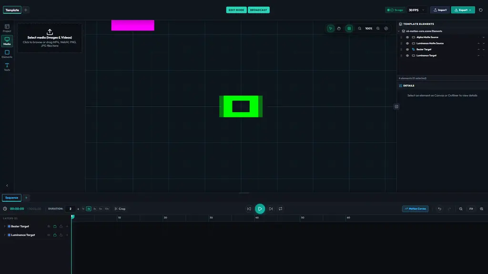
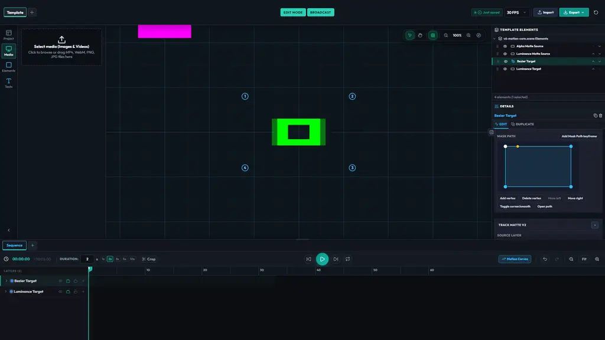
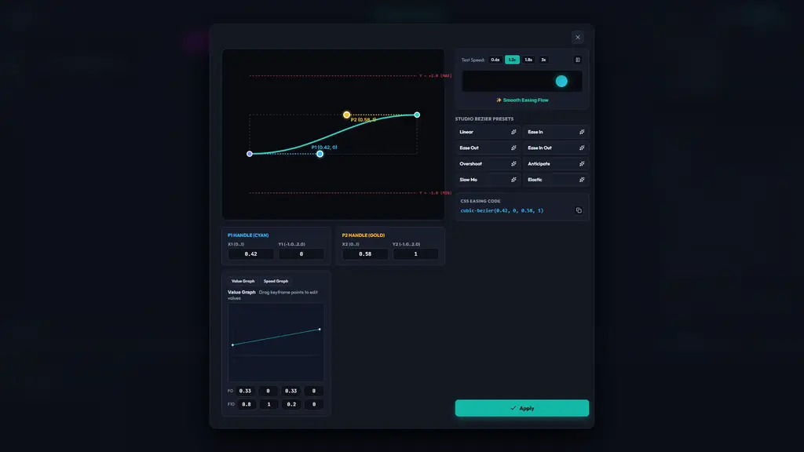
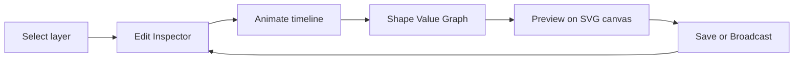
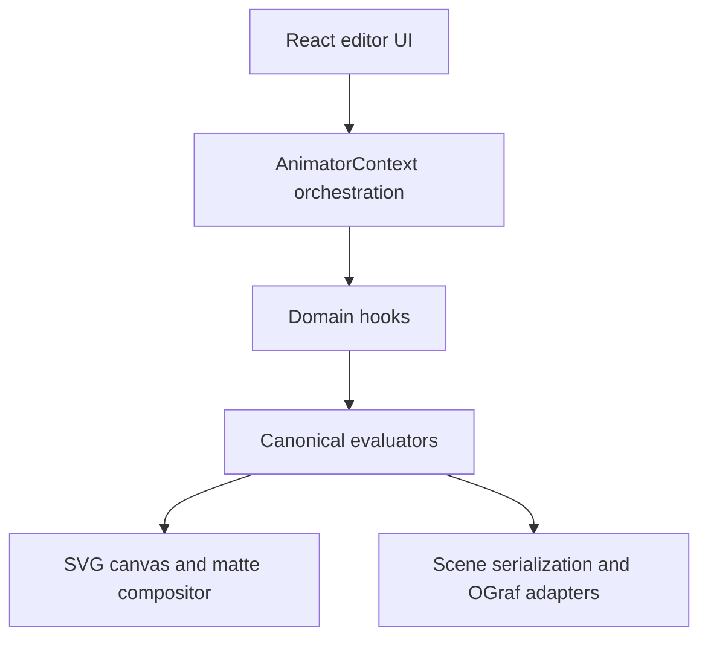

# Keyframe Character Studio

A browser-based 2D motion design editor for authoring vector graphics, animation, masks, mattes, and reusable broadcast-oriented compositions.

Keyframe Character Studio (KCS) combines a visual SVG canvas, timeline-based animation, graph editing, and project serialization in a focused React and TypeScript workspace. The current V6/UI work is developed on `feat/v6-ui-redesign`; `main` intentionally remains a stable earlier baseline.



[](https://github.com/ErtugrulAK/keyframe-character-studio/actions/workflows/ci.yml)
[](LICENSE)
[](https://react.dev/)
[](https://www.typescriptlang.org/)

## What KCS provides

- **Vector and text authoring** — Create and edit shapes, freeform paths, cards, banners, and text in an SVG-based canvas.
- **Timeline animation** — Animate transform and mask channels with keyframes, easing, hold segments, and reusable sequences.
- **Graph authoring** — Edit Value Graph curves with cubic Bézier controls; Speed Graph is currently a derived view.
- **Masks and mattes** — Layer masks, animated mask paths, alpha/luminance Track Matte V2, feather, expansion, strength, inversion, gradients, and relationship validation.
- **Composition tools** — Boolean shape operations, layer hierarchy, visibility/lock state, named sequences, and direct canvas editing.
- **Project portability** — Versioned scene serialization, legacy migration paths, undo/redo, and OGraf-oriented output/runtime support for the documented subset.
- **Broadcast-oriented workflows** — Edit and Broadcast modes with IN/OUT motion presets and live sequencing controls.

## Screenshots

### Masks and Track Matte

The Inspector exposes mask paths and Track Matte V2 controls while the canvas shows the evaluated composition.



### Timeline and animation

Timeline rows, property disclosure, frame navigation, and keyframe controls remain visible alongside the canvas and Inspector.


### Graph Editor and Bézier authoring

The Graph Editor provides Value Graph editing, Bézier handles, easing presets, and preview controls. Speed Graph remains derived/read-only until a canonical reverse conversion is defined.



## Feature status

| Feature | Status | Notes |
| --- | --- | --- |
| Vector shapes and text | Available | SVG canvas with direct selection and property editing. |
| Timeline animation and keyframes | Available | Canonical channel model with legacy compatibility. |
| Value Graph | Available | Shared evaluator and cubic Bézier controls. |
| Speed Graph editing | Planned | Derived view today; editable conversion is not yet defined. |
| Bézier paths | Available | Path topology, handles, and keyboard-accessible controls. |
| Layer masks | Available | Ordered mask composition with animated mask paths. |
| Track Matte V2 | Available | Alpha/luminance relationships with validation and animated sources. |
| Boolean shape operations | Available | Supported through the current geometry pipeline. |
| Named sequences | Available | Sequence-aware evaluation and serialization. |
| OGraf output/runtime | Partial | Supported fields are mapped; unsupported V6 compositing is preserved and reported. |

## Why KCS

KCS is intended for artists, motion designers, broadcast graphics developers, and engineers who want a small, inspectable authoring surface instead of a black-box renderer. The project favors explicit state ownership, deterministic evaluation, SVG-native composition, and compatibility-preserving migration over feature claims that are not backed by the current implementation.

## Visual map

### Authoring loop



### Runtime boundaries



`Track.channels` is the canonical animation representation. `evaluateTransform` and `evaluateFrame` own animation evaluation, while `shapeGeometry` and `buildMattePath` own geometry and matte paths. See [docs/ARCHITECTURE.md](docs/ARCHITECTURE.md) for module responsibilities and [docs/interop/V6_LOTTIE_MAPPING.md](docs/interop/V6_LOTTIE_MAPPING.md) for current interchange boundaries.

## OGraf and interoperability

KCS includes OGraf-oriented export and runtime paths for the supported scene subset. Export is not a claim of complete EBU or third-party player parity: unsupported V6 compositing is retained in `scene.kcs` and reported rather than silently flattened. The detailed mapping and compatibility boundary are documented in [V6 Lottie Mapping](docs/interop/V6_LOTTIE_MAPPING.md) and the source architecture.

## Getting started

### Prerequisites

- Node.js 22 or newer (the CI workflow uses Node.js 22)
- npm

### Run locally

```bash
git clone https://github.com/ErtugrulAK/keyframe-character-studio.git
cd keyframe-character-studio
npm install
npm run dev
```

Open [http://localhost:5173](http://localhost:5173). `npm run dev` starts the Vite frontend and the Express service together. The backend uses the configured database connection when available and has the repository's embedded SQLite path for local development.

### Verification commands

```bash
npm test
npm run test:e2e
npx tsc --noEmit
npm run lint
npm run build
npm run qa:v6
```

The V6/UI branch has recent verified results for the full regression and focused V6 checks. Always recalculate results from the commit you are testing; historical report counts are not a substitute for current command output.

## Repository guide

- `src/components/` — editor UI, canvas, Inspector, timeline, graph, and broadcast surfaces
- `src/hooks/` — domain orchestration and state authorities
- `src/utils/` — deterministic evaluation, geometry, migration, and mutation helpers
- `src/ograf/` — OGraf export and runtime adapters
- `e2e/` — Playwright browser and pixel regression coverage
- `docs/ARCHITECTURE.md` — detailed architecture
- `docs/V6_PLUS_ANIMATION_ROADMAP.md` — current delivered boundary and future work
- `CONTRIBUTING.md` — contributor setup and verification expectations

## Current status

KCS is in active development. The V6 motion core and professional UI work are available on their feature branches and this presentation branch is based on `feat/v6-ui-redesign`. The project is not presented as production-ready software or as complete standard parity. Browser verification is currently Chromium-focused; Firefox and Safari remain unverified.

## Roadmap

The short-term roadmap is maintained in [V6+ Animation Roadmap](docs/V6_PLUS_ANIMATION_ROADMAP.md). Confirmed future areas include deeper Bézier tangent authoring, explicit matte source selection, Lottie interchange, editable Speed Graph controls after a defined temporal conversion, and measured runtime-scale improvements. No roadmap item carries a promised release date.

## Contributing

Start with [CONTRIBUTING.md](CONTRIBUTING.md). For behavior changes, preserve canonical authorities, add regression coverage at the correct seam, and browser-check interaction or rendering changes. Pull requests should remain focused and must not weaken assertions to conceal regressions.

## Security

See [SECURITY.md](SECURITY.md) for supported-version scope and vulnerability reporting guidance.

## License

KCS is distributed under the [MIT License](LICENSE). Copyright (c) 2026 ErtugrulAK.
