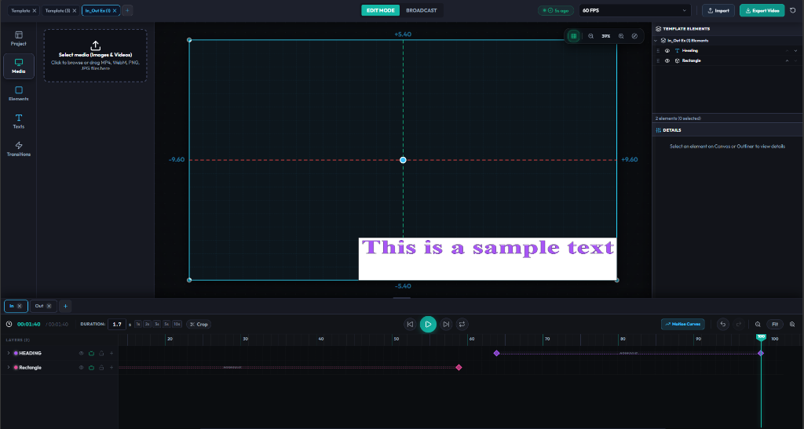
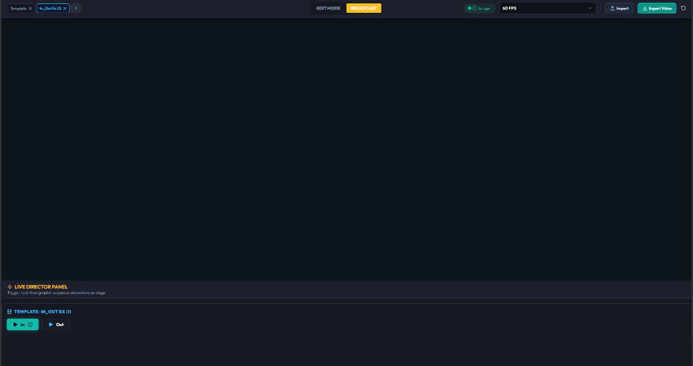
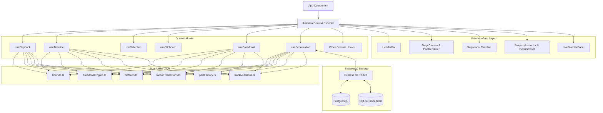

# 🎬 Keyframe Character Studio & Live Broadcast Motion Graphics Sequencer Pro

[](https://react.dev/)
[](https://www.typescriptlang.org/)
[](https://vitejs.dev/)
[](https://www.postgresql.org/)
[](https://expressjs.com/)
[](LICENSE)

An advanced **2D Vector Animation Studio, Motion Graphics Sequencer, & Real-Time Broadcast Motion Graphics Director** built with **React 19**, **TypeScript**, **Vite**, **Express**, **PostgreSQL**, and **Embedded SQLite**.

---

## 📸 Application Showcase

### 1. Main Studio Editor & Sequencer

*Figure 1: Full studio interface featuring the interactive Stage Canvas, multi-track Sequencer Timeline with Bezier Motion Curves, Template Tabs, and Property Inspector.*

### 2. Live Broadcast Director Panel (Reji Mode)

*Figure 2: Real-time broadcast control interface for triggering live graphic sequence animations, PLAY IN / PLAY OUT motion transitions, and stage stunts.*

---

## ✨ Overview & Core Capabilities

Keyframe Character Studio provides a browser-based timeline animation editor and live broadcast control panel designed for creating character animations, motion graphics templates, keyframe sequences, and real-time lower thirds or overlays for broadcast software (OBS Studio, vMix, NDI, etc.).

### 1. 🎬 Motion Design Sequencer
- **Multi-Track Hierarchy**: Layer ordering, track lock, eye visibility toggles, and z-index ordering.
- **Precision Keyframing**: Interpolates position (`x`, `y`), scale (`scaleX`, `scaleY`), rotation, and opacity at 60 FPS.
- **Interactive Cubic Bezier Easing**: Fine-tune animation curves with velocity control, preset curves, and real-time preview canvas.
- **Unified Sequence Tabs**: Create, rename (double-click inline edit), switch, and delete sequence motion templates.

### 2. 📐 Single-Edge Directional Vector Transform Gizmo
- **8-Handle Transform Controls**: Corner handles for proportional scaling + 4 midpoint handles for single-edge stretching.
- **Directional Edge Resizing**: Dragging top, bottom, left, or right handles expands elements strictly along that direction while keeping opposite edges fixed in world coordinates (trigonometric matrix math).
- **Interactive Rotation**: Top bar knob for intuitive 360° rotation.

### 3. 🎭 Track Matte — SVG Clip / Alpha / Luminance / Feather
- **SVG-based matte system**: Clip a layer by another layer's (the source's) world-space shape geometry — pure SVG (`clipPath` / `<mask>`); **no Canvas 2D / PixiJS / Fabric.js**.
- **Matte modes**:
  - ✂️ **Clip** — hard geometric clip via SVG `clipPath`
  - 🩸 **Alpha** — alpha-channel mask: inside the geometry visible, outside hidden
  - 💡 **Luminance** — luminance-based mask: white = visible, black = hidden, gray = partial
- **Inverted matte**: hide INSIDE the source geometry (mask-based; single evenodd path for alpha, white region + black geometry for luminance).
- **Matte Feather**: soft edges via `feGaussianBlur` (`stdDeviation = feather / 2`), applied in world-space pixels; sharp edge when `0`/unset.
- **Freeform sources (M15)**: shapes drawn with the Free Draw tool (`custom_freeform`) can be matte sources too — their polygon is built from the same `CharacterPart.points` the renderer draws, and works with Clip / Alpha / Luminance / Inverted / Feather, including animated sources.
- **Matte Strength (M16)**: control the matte's intensity from the Inspector (0–100% slider; 50% = half-strength soft mask). Applies to Alpha/Luminance/Inverted modes; inactive in Clip mode. Optional — legacy mattes render at full strength.
- **Gradient Track Matte (M17)**: linear, source-local gradient with angle control (0–360°) — the gradient is painted through the matte (white→transparent for Alpha, white→black for Luminance) and follows the source's movement/rotation/scale/animation; combines with Feather and Strength; freeform sources supported; Clip mode unaffected. Radial / preset / animated gradients are deferred.
- **Text Track Matte (M18)**: text parts can now act as matte sources — the glyphs become the mask content (alpha / luminance / inverted-luminance, gradient, feather, strength, transforms, animation tracking and serialization parity via `sourcePartId`); text + Clip is not supported (UI-guarded). Image/video mattes remain deferred.
- **Custom / Multi-stop Gradient (M19)**: 2–4 custom gradient stops (offset / color / opacity) with a deterministic normalization + hashed def identity — different stops on the same source never collide (dedupe is stops-aware), legacy `{angle}` gradients keep their exact behavior until edited, and everything works with feather, strength, inversion, transforms and text mattes (including inverted-text world-space gradient handling). Radial / preset / animated gradients remain deferred.
- Geometry comes from the single `shapeGeometry → buildMattePath` chain (world-space; animated with the source's own keyframes/channels; no matte animation channels).
- Browser behavior is **Chromium pixel-verified** (real compositing tests); Firefox/Safari not yet verified.
- Architecture details: `skills/keyframe-studio/kcs-track-matte/SKILL.md` · wiki: `wiki/entities/keyframe-character-studio.md`.

### 4. 🎨 Unified Graphic Template & Sequence Management
- **Dual Tab Architecture**: Unified top Header bar (Graphic Templates) and bottom Timeline (Sequence Tabs) sharing identical styling, heights, hover states, and close icons.
- **Inline Tab Renaming**: Double-click any template or sequence tab to edit its title directly in-place.
- **Clean Modal Workflows**: Default modals for `New Template` and `New Sequence`.

### 5. 📡 Real-Time Live Director Panel (Reji Mode)
- **Live Broadcast Controls**: Zero-latency triggers for broadcast streaming platforms.
- **PLAY IN / PLAY OUT**: Trigger entrance & exit motion transitions live on air per graphic layer or globally.
- **Eye Mute Sync**: Layers hidden or muted on timeline automatically sync state with broadcast output.
- **Live Motion Stunts**: Trigger mid-broadcast stunts (Bounce, Pulse, Wobble, Spin 360, High-frequency Shake, Float, and custom keyframe loops).

### 6. 🗄️ Dual Database Architecture & REST API Server
- **PostgreSQL Database (`server/db/schema.sql` & `server/db/seed.sql`)**: Relational database for production environments.
- **Embedded SQLite Local Database (`keyframe_studio.sqlite`)**: Automatic fallback embedded database enabling zero-config execution without external software requirements.
- **Express REST API Backend**: Handlers for project serialization, motion presets, and system health checks.

---

## 🏛️ High-Level Architecture

The project adheres strictly to the **Thin Orchestrator Pattern**:
- `AnimatorContext` serves exclusively as a dependency injection and state orchestration layer.
- Business logic is isolated inside 15 domain-specific hooks (`usePlayback`, `useTimeline`, `useSelection`, `useClipboard`, `useBroadcast`, etc.).
- Complex mathematical transformations, interpolations, and shape calculations are handled by pure utility modules (`src/utils/`).



---

## 📂 Repository Directory Structure

```text
keyframe-character-studio/
├── .agents/                    # Agent constitution, branch strategy, and workflows
│   ├── AGENTS.md               # Project constitution and core rules
│   ├── BRANCH_STRATEGY.md      # Branching rules and lifecycle policy
│   ├── PROJECT_CONTEXT.md      # Architecture boundaries and technology stack
│   └── workflows/              # Standard operational workflows
├── docs/                       # Project documentation
│   ├── API.md                  # REST API specification
│   ├── ARCHITECTURE.md         # In-depth architectural guide
│   └── postgres-setup-guide.md # PostgreSQL setup instructions
├── e2e/                        # Playwright end-to-end test suite
│   ├── workflow.spec.ts
│   └── track-matte.spec.ts     # Track Matte browser/pixel verification
├── public/                     # Static public assets
├── scripts/                    # Database setup scripts
│   └── setup-db.js
├── server/                     # Backend REST API server
│   ├── index.js                # Express app entrypoint & API routes
│   └── db/                     # PostgreSQL pool & SQLite fallback engine
│       ├── index.js            # PostgreSQL connection pool
│       ├── schema.sql          # PostgreSQL schema
│       ├── seed.sql            # PostgreSQL seed data
│       └── sqlite.js           # SQLite embedded engine
├── src/                        # Frontend source code
│   ├── components/             # UI components (Canvas, Header, Inspector, Timeline, Broadcast)
│   ├── context/                # AnimatorContext orchestrator
│   ├── hooks/                  # 15 domain-specific React hooks
│   ├── tests/                  # 21 Vitest unit & integration test suites
│   ├── types/                  # TypeScript interface definitions
│   └── utils/                  # Pure mathematical and state utility functions
├── index.html                  # Main HTML entrypoint
├── package.json                # Project dependencies and script definitions
├── playwright.config.ts        # Playwright E2E configuration
├── tsconfig.app.json           # Application TypeScript configuration
├── vite.config.ts              # Vite bundler configuration
└── vitest.config.ts            # Vitest testing environment configuration
```

---

## 🛠️ Technology Stack

| Layer | Technology |
| :--- | :--- |
| **Frontend UI** | React 19.2, TypeScript 6.0, Vite 8.1, Lucide React, CSS3 Glassmorphism |
| **Animation & Render Engine** | SVG Vector Engine, Matrix Trigonometry, Cubic Bezier Interpolation |
| **Backend REST API** | Node.js, Express 5.2, CORS, Dotenv |
| **Database Layer** | PostgreSQL 16 (Production) + Embedded SQLite 3 (Zero-config Fallback) |
| **Testing & Quality** | Vitest 4.1, React Testing Library, Playwright 1.62, Oxlint |

---

## 🚀 Quick Start

### 1. Prerequisites
- **Node.js**: v18.0.0 or higher
- **npm**: v9.0.0 or higher

### 2. Installation
```bash
git clone https://github.com/ErtugrulAK/keyframe-character-studio.git
cd keyframe-character-studio
npm install
```

### 3. Running the Application

#### Concurrent Mode (Frontend + Backend Server)
```bash
npm run dev
```
- Frontend Dev Server: [http://localhost:5173](http://localhost:5173)
- Backend REST API: [http://localhost:5000](http://localhost:5000)

#### Independent Frontend Dev Server
```bash
npm run dev:frontend
```

#### Independent Backend REST API Server
```bash
npm run server
```

### 4. Database Setup (Optional)
By default, the backend automatically creates and uses an embedded local SQLite database (`keyframe_studio.sqlite`). If PostgreSQL is installed:
```bash
npm run db:setup
```
*(For detailed PostgreSQL instructions, refer to [docs/postgres-setup-guide.md](docs/postgres-setup-guide.md))*

---

## 🧪 Testing & Validation

### Unit & Integration Tests (Vitest)
Run the Vitest test suite covering 21 test files (62 tests):
```bash
npx vitest run
```

To run tests with limited memory allocation or sequential execution:
```bash
npx vitest run --maxWorkers=2
```

### End-to-End Tests (Playwright)
Run the Playwright E2E test suite:
```bash
npm run test:e2e
```

### Type Checking & Linting
```bash
npx tsc --noEmit
npm run lint
```

### Production Build
```bash
npm run build
```

---

## 🌐 API Overview

The Express backend exposes endpoints for project persistence, motion presets, and health checks:

| Method | Endpoint | Description |
| :--- | :--- | :--- |
| `GET` | `/api/health` | Health check reporting service status and active DB (PostgreSQL vs SQLite) |
| `GET` | `/api/projects` | Fetch list of saved animation projects |
| `GET` | `/api/projects/:id` | Fetch detailed project payload by ID |
| `POST` | `/api/projects` | Save or update an animation project |
| `DELETE` | `/api/projects/:id` | Delete a project by ID |
| `GET` | `/api/presets` | Fetch available custom motion presets |
| `POST` | `/api/presets` | Create or update a custom motion preset |

*(For full endpoint request/response payloads, see [docs/API.md](docs/API.md))*

---

## 📜 NPM Scripts Reference

| Script | Command | Description |
| :--- | :--- | :--- |
| `dev` | `concurrently "node server/index.js" "vite --host"` | Runs backend server and frontend dev server concurrently |
| `dev:frontend` | `vite --host` | Starts Vite frontend dev server on port `5173` |
| `server` | `node server/index.js` | Starts Express REST API backend server on port `5000` |
| `db:setup` | `node scripts/setup-db.js` | Executes PostgreSQL database setup and seeds initial data |
| `build` | `tsc -b && vite build` | Compiles TypeScript and builds Vite production bundle |
| `lint` | `oxlint` | Runs Oxlint code quality and static analysis |
| `preview` | `vite preview` | Previews production build locally |
| `test:e2e` | `playwright test` | Executes Playwright end-to-end tests |

---

## 🤝 Contributing

Contributions are welcome! Please read [CONTRIBUTING.md](CONTRIBUTING.md) for details on code style, conventional commits, branch workflow (`.agents/BRANCH_STRATEGY.md`), and pull request guidelines.

---

## 📄 License

This project is licensed under the [MIT License](LICENSE).
